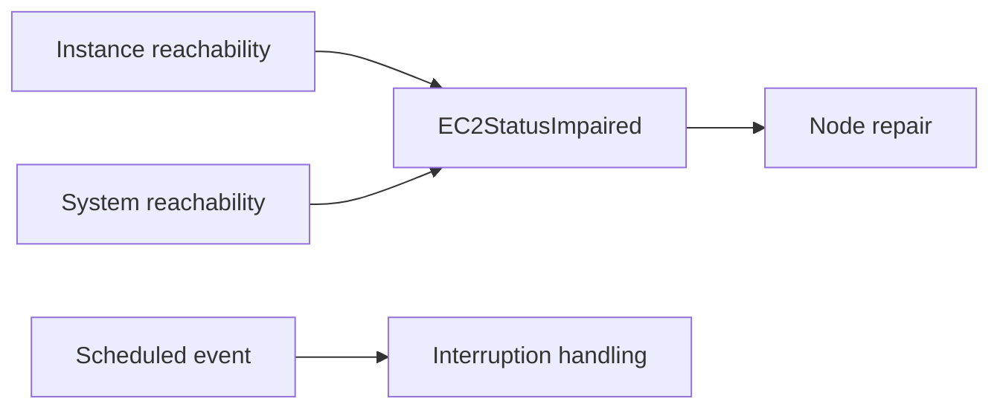

# `DescribeInstanceStatus` for Repair Design

**Status:** Approved

**Context:** Karpenter Node Repair through voluntary disruption.

**Depends on:** Reason-aware repair policy matching and candidate admission in Karpenter core.

## Motivation

`DescribeInstanceStatus` exposes EC2 health assessments and lifecycle notifications through one API. A failed instance or system status check is a diagnosis, while a scheduled event indicates that a lifecycle action is planned or underway. The shared API shape does not establish whether Karpenter is choosing remediation or accommodating an external commitment.

Voluntary disruption subjects chosen remediation to budgets, vetoes, and workload controls. Applying that safety model requires preserving what EC2 reported without creating a Node condition for every assessment: instance and system assessments may overlap and recover independently, while an incomplete poll must not imply health or recovery.

The remaining problem is to define which EC2 observations belong to interruption handling and which belong to repair. For repair observations, the design must aggregate EC2 reachability evidence into a bounded health signal and define where health reporting ends and repair policy begins.

### Terminology

- **Instance status:** EC2's reachability assessment of the software and network configuration of an individual instance.
- **System status:** EC2's reachability assessment of the AWS system hosting an instance.
- **Scheduled event:** An EC2 notification that an instance lifecycle action is planned or underway.
- **Reachability detail:** The EC2 [`InstanceStatusDetails`](https://docs.aws.amazon.com/AWSEC2/latest/APIReference/API_InstanceStatusDetails.html) entry that reports a reachability status and, when available, when the check became impaired.

## Scope

- Define how EC2 instance-status and system-status reachability observations become Node health signals.
- Define their provider repair policy and their boundary with interruption handling.
- Define condition transitions under recovery and incomplete EC2 observation for registered Karpenter-managed Nodes.

### Out of Scope

- Changing EC2 scheduled-event handling, instance lifecycle handling, or attached-EBS status handling.
- Repair before a managed Node and NodeClaim are registered.
- Health freshness, condition expiry, and a general replacement for last-writer-wins Node-condition ownership.
- Customer-configurable EC2 repair policy.

## Tenets

- **Faithful evidence.** Publish only what EC2 reports - failed observation must not imply health or recovery.
- **Bounded representation.** Instance-status and system-status assessments share one Node condition because they carry the same repair semantics; condition count must not scale with individual EC2 assessments.
- **Shared repair authority.** Health production reports diagnoses. Provider policy and voluntary-disruption controls determine whether and how Karpenter acts.

## Design

The design separates EC2 health reporting from repair policy and repair execution. Four product decisions are made and justified below:

1. Route instance and system reachability diagnoses through repair while leaving scheduled events on the interruption path.
2. Aggregate instance and system impairment into one `EC2StatusImpaired` Node condition.
3. Derive the aggregate condition's clock from EC2's observation when available, and never infer recovery unless both assessment scans complete without recognized impairment.
4. Apply one visible replacement policy to the condition while publishing health independently of the `NodeRepair` feature gate.

### Routing

`DescribeInstanceStatus` combines diagnoses with lifecycle notifications. A scheduled event indicates that EC2 has scheduled or begun an instance lifecycle action, which cannot be deferred by a voluntary repair budget. A failed instance or system status check carries no equivalent commitment. It is evidence that replacement may help, but Karpenter still chooses whether and when to act.

**Routing boundary.** Instance-status and system-status impairment therefore enter the voluntary repair path. Scheduled events remain on the interruption path. Policy toleration expresses the confidence required before acting on an EC2 diagnosis, which remains subject to voluntary-disruption controls.

*Figure 1. Instance and system reachability diagnoses enter repair; scheduled events remain on interruption handling.*

The provider must not publish a repair signal and submit an interruption for the same instance-status or system-status observation. Doing both would allow two controllers with different safety semantics to actuate the same diagnosis.

This contract begins only after Karpenter has a registered managed Node and NodeClaim pair: the Node carries health, and the NodeClaim identifies the EC2 instance. Failures before that association exists remain part of instance lifecycle and registration handling.

### Condition Representation

Repair consumes `NodeCondition`s. EC2 instance-status and system-status assessments can overlap and transition independently, but they carry the same repair action and policy. Publishing one condition per assessment would grow Node status without changing the resulting repair decision, so the provider aggregates both assessments into one condition.

This deliberately gives repair one EC2 impairment clock. The clock measures an uninterrupted period in which the provider has evidence of any EC2 reachability impairment; it does not preserve each assessment's individual duration.

#### Condition Contract

The provider publishes one `EC2StatusImpaired` condition.

| Condition type | Status | Reason | Message |
| --- | --- | --- | --- |
| EC2StatusImpaired | True | ReachabilityFailed | EC2 reports one or more reachability checks are failing. |
| EC2StatusImpaired | False | NoImpairmentReported | EC2 reports no recognized instance or system reachability impairment. |

When `True`, the message identifies the completed assessments that currently report impairment - instance, system, or both - and any assessment scan that did not complete. The stable reason avoids encoding every assessment combination into the condition contract.

#### Assessment Completion

Each filtered scan is one assessment scan. A **complete assessment scan** retrieves every response page and determines whether that assessment contains a recognized reachability failure. The provider attempts both scans independently and evaluates their completed results together:

| Completed scan evidence | Aggregate result |
| --- | --- |
| Either complete scan contains a reachability detail with `Status=failed` | `True`, regardless of the other scan's outcome. |
| Both scans complete and neither contains a recognized reachability failure | `False`. |
| No complete scan reports impairment and either scan is incomplete or failed | Make no condition change. |

The provider attempts both assessment scans independently. Failure of one does not prevent the other from completing and publishing its condition; the failed assessment remains unchanged. After a complete scan, EC2 may report `passed`, omit the failed detail, or return another value that this contract does not recognize as impairment. Those outcomes contribute no recognized impairment, but they clear the aggregate condition only when the other scan also completes without recognized impairment.

`NoImpairmentReported` is deliberately weaker than `Healthy` or `ReachabilityPassed`. `False` means both complete assessment scans contained no recognized reachability failure - it does not claim that EC2 affirmatively reported passed checks.

### Observation and Transition Semantics

Repair eligibility is reconstructed from `NodeCondition.lastTransitionTime` and provider policy. EC2 reports impairment onset through `ImpairedSince`. The **observation time** is when the provider finishes both assessment-scan attempts for a reconciliation and evaluates their aggregate result.

#### Transition Clock

When the aggregate condition enters `True`, the provider uses the earliest `ImpairedSince` among the complete scans that report impairment, or observation time when none is available. While the condition remains `True`, it preserves `lastTransitionTime` even if the contributing assessment changes. Recovery uses observation time because both scans completing without recognized impairment are the first evidence that aggregate EC2 impairment is no longer reported.

The source timestamp prevents observation delay or controller restart from restarting toleration. Preserving the clock while `True` means toleration measures one uninterrupted interval with any EC2 reachability impairment, rather than separate instance-status and system-status intervals.

#### Condition Ownership

The AWS provider is the sole writer for `EC2StatusImpaired`. It patches only that entry and preserves conditions written by kubelet, NMA, and other controllers. The provider applies these aggregate rules:

| Current condition | EC2 observations | Published result | `lastTransitionTime` |
| --- | --- | --- | --- |
| Absent or `False` | At least one complete scan reports `reachability=failed` | `True / ReachabilityFailed` | Earliest reported EC2 `ImpairedSince`, or observation time when unavailable. |
| Absent | Both scans complete with no recognized reachability failure | `False / NoImpairmentReported` | Observation time. |
| `True` | Both scans complete with no recognized reachability failure | `False / NoImpairmentReported` | Observation time. |
| Status already matches the aggregate result | Completed observations produce the same aggregate status | Preserve status and reason; update the message from current observations. | Preserve the existing value. |
| Any state | No complete scan reports impairment and at least one scan is incomplete or failed | Make no condition change. | Preserve the existing value, or remain absent. |

#### Poll Failures

An incomplete or failed assessment scan cannot establish that its assessment reports no impairment. A complete scan that reports impairment may still set or retain `EC2StatusImpaired=True` when the other scan fails, but recovery requires both scans to complete without recognized impairment. A polling failure never changes the condition to `Unknown`.

Before the provider has either a complete positive scan or two complete scans with no recognized impairment, the condition remains absent. Absence is non-actionable and is not evidence of health.

The condition retains its last aggregate state during an inconclusive polling outage, but this design does not establish how long that observation remains fresh. Freshness was intentionally deferred for matching and admission because every health-signal producer needs the same freshness rule; this design does not add an EC2-only expiry rule.

The provider keeps no additional impairment timer or per-assessment condition state outside Node status. Each reconciliation reconstructs the aggregate result from completed EC2 scans and current Node status, while stable status preserves `lastTransitionTime`.

For example:

1. EC2 reports instance impairment beginning at `10:00`. At `10:01`, complete scans report instance impairment and no system impairment, so the provider publishes `EC2StatusImpaired=True` with `lastTransitionTime=10:00`.
2. EC2 reports system impairment beginning at `10:01:30`. Complete scans now report both impairments, so the condition remains `True`, its message identifies both assessments, and `lastTransitionTime` remains `10:00`.
3. At `10:03`, complete scans report that instance impairment has recovered while system impairment continues. The condition remains `True`, its message identifies system impairment, and `lastTransitionTime` remains `10:00` because aggregate EC2 impairment was uninterrupted.
4. At `10:04`, the instance scan reports no impairment but the system scan fails before all pages complete. No complete scan reports impairment and the aggregate result is inconclusive, so the condition remains unchanged.
5. At `10:05`, both scans complete without recognized impairment. The condition becomes `False` with `lastTransitionTime=10:05`.

### Repair Policy

Because `DescribeInstanceStatus` identifies reachability impairment but not a reboot-clearable fault, `EC2StatusImpaired` uses `ReplaceNode`. The policy also needs a confidence delay and a bound on drain.

#### Confidence Delay

Two minutes preserves the provider's existing [120-second confirmation window](https://github.com/aws/karpenter-provider-aws/blob/3deed399d666/pkg/providers/instancestatus/instancestatus.go#L44-L45), which is [currently enforced against `ImpairedSince` before a status is surfaced](https://github.com/aws/karpenter-provider-aws/blob/3deed399d666/pkg/providers/instancestatus/instancestatus.go#L120-L132). Moving that wait into `RepairPolicy` makes it visible to matching and allows it to be reconstructed from the condition clock.

#### Drain Bound

A zero termination grace period would skip drain even when kubelet remains reachable, while an unbounded period could leave repair waiting indefinitely on an impaired host. Five minutes gives a responsive kubelet a practical opportunity to honor PDBs, pod grace, and ordinary eviction while placing a firm ceiling on that attempt.

The resulting provider policy is:

| Condition type | Status | Reason regex | Toleration | Termination grace period | Action |
| --- | --- | --- | --- | --- | --- |
| `EC2StatusImpaired` | `True` | empty fallback | `2m` | `5m` | `ReplaceNode` |

Toleration is measured from `lastTransitionTime`. A newly published condition may therefore be immediately eligible when EC2 reports an onset more than two minutes old. In the example above, aggregate impairment becomes eligible at `10:02`.

The five-minute drain bound starts at repair commitment, as defined by candidate admission, rather than at impairment onset. Simultaneous instance-status and system-status impairment still produces one matching condition and one `ReplaceNode` candidate.

## Observability

The Node condition exposes the last aggregate EC2 impairment state and when the uninterrupted aggregate state began. Its message identifies completed assessments currently observed failing and any assessment scan that did not complete.

After matching, repair decision logs and shared budget and veto signals explain the selected action or why it did not proceed. Existing [AWS SDK metrics](https://karpenter.sh/docs/reference/metrics/#aws-sdk-go-metrics) expose `DescribeInstanceStatus` request outcomes. `controller_runtime_reconcile_errors_total` and reconciliation logs expose individual failed assessment scans, including reconciliations where one scan fails and the other reports impairment.

`karpenter_interruption_instance_status_unhealthy_total` counts each uninterrupted instance-and-assessment occurrence once per controller process. A complete recovery scan allows a later impairment to count as a new occurrence. The deduplication cache is intentionally process-local: after restart, a still-active impairment may be counted again, and no auxiliary Kubernetes API state is written for metric continuity.

## Alternatives Considered

### Separate Conditions for Instance and System Status

Publish `EC2InstanceStatusImpaired` and `EC2SystemStatusImpaired` independently. This would preserve separate transition clocks and allow either assessment to clear its own condition when the other assessment scan fails.

**Why It Falls Short.** Both assessments use the same repair policy and produce the same `ReplaceNode` candidate. Separate conditions would grow Node status with assessment granularity without changing the repair decision. The aggregate condition accepts one uninterrupted EC2 impairment clock and uses conservative recovery semantics to keep the API surface bounded.

### Continue Through Interruption Handling

Treat failed status checks like scheduled events and replace the instance through interruption handling. This would reuse the provider's existing repair execution path and preserve immediate replacement behavior without introducing repair policies for these signals.

**Why It Falls Short.** A scheduled event is an external commitment that Karpenter must accommodate; a failed status check is a diagnosis on which Karpenter chooses whether to act. Interruption handling would bypass voluntary controls and leave behavior outside the generic repair authority.

### Retain a Provider-Side Persistence Threshold

Continue withholding impairment until the publisher observes that `ImpairedSince` is at least two minutes old, then apply repair policy after publication. This would preserve the current filtering boundary and prevent short-lived impairments from appearing as actionable Node conditions.

**Why It Falls Short.** Splitting the confidence delay between publication and policy would either compound the waits or hide part of the delay from generic matching and observability. Publishing immediately and measuring one policy toleration from the same EC2 onset keeps evidence faithful and repair behavior visible.
